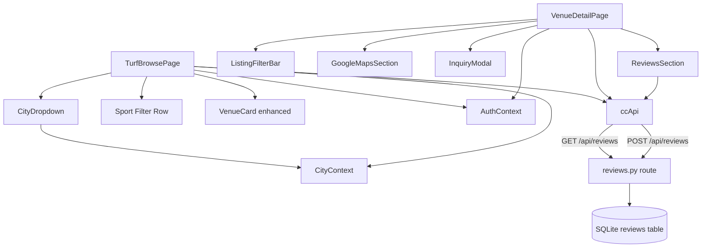

# Design Document: Turf Browse & Venue Detail Improvements

## Overview

This feature enhances two existing pages — **TurfBrowsePage** (`/turf`) and **VenueDetailPage** (`/venue/:id`) — making venue discovery more contextual and the detail page significantly richer.

The key additions are:
- A compact `CityDropdown` that replaces the full-width `CityBar` chip row on TurfBrowsePage, with automatic city pre-selection based on the logged-in user's profile.
- Functional sport filtering on TurfBrowsePage that actually filters venues by their active listings.
- Sport-aware `VenueCard` previews showing which listings match the active filter.
- On VenueDetailPage: a `ListingFilterBar`, an embedded Google Maps section, an `InquiryModal` for contacting the venue, and a full `ReviewsSection` backed by a new backend reviews API.
- Backend: a `venue_id` DB migration for the `reviews` table, a new `/api/reviews` route module, and typed `ccApi` client additions.

All UI follows the existing dark navy/teal theme with BEM-like class names. No new UI libraries are introduced.

---

## Architecture

The feature spans three tiers:

```
┌─────────────────────────────────────────────────────────┐
│ Frontend (React 18 + TypeScript)                         │
│                                                          │
│  TurfBrowsePage                 VenueDetailPage          │
│    ├── CityDropdown (new)         ├── ListingFilterBar   │
│    ├── Sport Filter Row           ├── GoogleMapsSection  │
│    └── VenueCard (enhanced)       ├── InquiryModal       │
│                                   └── ReviewsSection     │
│                                                          │
│  Context: CityContext, AuthContext                       │
│  API Client: ccApi (additions)                           │
└─────────────────────────┬───────────────────────────────┘
                           │ HTTP / JWT
┌─────────────────────────▼───────────────────────────────┐
│ Backend (Python 3.14 + FastAPI)                          │
│                                                          │
│  app/api/routes/reviews.py  (new)                        │
│  app/models/match.py        (Review model updated)       │
│  app/db/migrations.py       (venue_id column added)      │
│  app/main.py                (reviews router registered)  │
└─────────────────────────────────────────────────────────┘
```

The frontend communicates with the backend exclusively through `ccApi` in `src/lib/ccApi.ts`. No new API clients are introduced. New route methods (`venueReviews`, `submitReview`) are appended to the existing `ccApi` object.

State management remains in React local state + existing contexts (no Redux or Zustand). The `CityContext` provides `clearCities` and `toggleCity`; the auto-default logic runs in a `useEffect` on TurfBrowsePage mount.

---

## Components and Interfaces

### New Frontend Components

#### `CityDropdown` — `src/components/ui/CityDropdown.tsx`

Replaces `CityBar` on TurfBrowsePage. A single-select inline dropdown.

```typescript
interface CityDropdownProps {
  // No explicit props — reads CityContext internally
}
```

Internal state: `open: boolean`. Reads `cities`, `toggleCity`, `clearCities`, `isSelected` from `useCity()`.

- Renders a `<button>` trigger showing the selected city or "All Cities".
- On open, renders a positioned dropdown list with "All Cities" first, then all `CC_CITIES`.
- Selecting "All Cities" calls `clearCities()`. Selecting a city calls `clearCities()` then `toggleCity(city)`.
- Keyboard: `Enter`/`Space` opens, `Escape` closes, `ArrowUp`/`ArrowDown` moves focus through options.
- CSS classes: `city-dropdown`, `city-dropdown__trigger`, `city-dropdown__list`, `city-dropdown__option`, `city-dropdown__option--active`.

#### `ListingFilterBar` — inline in `VenueDetailPage.tsx`

A horizontally-scrollable chip row above the listings grid.

```typescript
interface ListingFilterBarProps {
  categories: Category[];        // distinct categories from active listings
  selected: string;              // 'all' or category slug
  onSelect: (slug: string) => void;
}
```

Renders an "All" chip and one chip per category, each showing the `SPORT_ICONS` emoji and category name. Applies `listing-filter-bar__chip--active` to the selected chip. CSS: `listing-filter-bar`, `listing-filter-bar__chip`.

#### `InquiryModal` — `src/components/ui/InquiryModal.tsx`

A full-screen overlay modal with a contact form.

```typescript
interface InquiryModalProps {
  venue: Venue;
  onClose: () => void;
}
```

Internal state: `name: string`, `contact: string`, `message: string`, `errors: Record<string, string>`. Pre-fills `name` from `user.name` and `contact` from `user.phone || user.email` if the user is logged in.

On submit:
1. Validates Name, Contact are non-empty; Message is non-empty.
2. If `venue.phone` is set → opens `https://wa.me/{sanitisedPhone}?text={encodedMessage}`.
3. Else if `venue.email` is set → opens `mailto:{venue.email}?subject=Inquiry from {name}&body={message}`.
4. Else → displays informational message inline.

Phone sanitisation: strip all non-digit characters, prepend country code `91` if 10 digits.

Closes on `×` button click or `Escape` keydown on the modal overlay.

CSS classes: `inquiry-modal`, `inquiry-modal__overlay`, `inquiry-modal__header`, `inquiry-modal__form`, `inquiry-modal__field`, `inquiry-modal__error`.

#### `ReviewsSection` — inline in `VenueDetailPage.tsx` (or separate component)

Displays reviews and a submission form.

```typescript
interface ReviewsSectionProps {
  venueId: number;
}
```

Internal state: `reviews: Review[]`, `loadError: string`, `avgRating: number`, `submitting: boolean`, `submitError: string`, `rating: number`, `comment: string`.

On mount: calls `ccApi.venueReviews(venueId)`. On success, sets reviews. On failure, sets `loadError`.

Renders:
- Header: `★ {avgRating} · {count} reviews`
- Review cards: star display, username, comment, `created_at` formatted as "MMM YYYY"
- Submission form (if logged in) or sign-in prompt (if not)

### Enhanced Existing Components

#### `VenueCard` (in `TurfBrowsePage.tsx`)

Receives `selectedSport` and `listings` (pre-fetched). When `selectedSport !== 'all'`, finds matching active listings and renders a subtitle:
- 1 match: `"Cricket Turf A"`
- N > 1 matches: `"Cricket Turf A + 2 more"`

CSS: `venue-card-v2__listing-preview`, `venue-card-v2__listing-more`.

#### `TurfBrowsePage.tsx`

Two new behaviours:
1. **City auto-default**: `useEffect` that runs once after `user` and `cities` are available, checks `user?.city` against `CC_CITIES` (case-insensitive), calls `toggleCity(user.city)` only if `cities.length === 0`.
2. **Listing fetch for sport filter**: After loading venues, if any venue's `listings` array is undefined/empty, fetches via `ccApi.venueListings(venue.id)` for all such venues in parallel, then merges results. The sport filter then checks `venue.listings` in-memory.

#### `VenueDetailPage.tsx`

New behaviours:
1. Reads `?sport=<slug>` via `useSearchParams()`.
2. Sorts listings: matching slug first (stable sort).
3. Renders `ListingFilterBar`, `GoogleMapsSection`, `InquiryModal` (conditional on `showInquiry` state), `ReviewsSection`.

---

## Data Models

### Frontend Types (additions to `src/lib/ccApi.ts`)

```typescript
export interface Review {
  id: number;
  venue_id: number;
  listing_id: number | null;
  user_id: number;
  username: string;
  rating: number;          // 1–5
  comment: string;
  is_verified_visit: boolean;
  created_at: string;      // ISO 8601
}
```

New `ccApi` methods:

```typescript
venueReviews: (venueId: number) => req<Review[]>(`/api/reviews?venue_id=${venueId}`),

submitReview: (payload: { venue_id: number; rating: number; comment: string }) =>
  req<Review>('/api/reviews', { method: 'POST', body: JSON.stringify(payload) }),
```

### Backend Model Update (`backend/app/models/match.py`)

The existing `Review` class gains a `venue_id` column and `listing_id` becomes explicitly nullable:

```python
class Review(Base):
    __tablename__ = "reviews"

    id: Mapped[int] = mapped_column(Integer, primary_key=True)
    venue_id: Mapped[int] = mapped_column(          # NEW
        Integer, ForeignKey("venues.id", ondelete="SET NULL"), nullable=True, index=True
    )
    listing_id: Mapped[int] = mapped_column(
        Integer, ForeignKey("listings.id", ondelete="CASCADE"), nullable=True, index=True
    )
    user_id: Mapped[int] = mapped_column(
        Integer, ForeignKey("users.id", ondelete="CASCADE"), nullable=False, index=True
    )
    booking_id: Mapped[int] = mapped_column(
        Integer, ForeignKey("bookings.id", ondelete="SET NULL"), nullable=True
    )
    rating: Mapped[int] = mapped_column(Integer, nullable=False)
    comment: Mapped[str] = mapped_column(String(500), default="", nullable=False)
    is_verified_visit: Mapped[bool] = mapped_column(Boolean, default=False, nullable=False)
    created_at: Mapped[datetime] = mapped_column(
        DateTime(timezone=True), server_default=func.now(), nullable=False
    )
```

### Backend Migration (`backend/app/db/migrations.py`)

Added to `ensure_dev_schema()`:

```python
# ── reviews ────────────────────────────────────────────────────────────────
if "reviews" in tables:
    review_cols = {c["name"] for c in inspector.get_columns("reviews")}
    if "venue_id" not in review_cols:
        _add_column(conn, "reviews", "venue_id",
                    "INTEGER REFERENCES venues(id) ON DELETE SET NULL")
```

### Backend Pydantic Schemas (`backend/app/schemas/` — new file or appended to `match.py`)

```python
from pydantic import BaseModel, Field
from typing import Optional
from datetime import datetime

class ReviewCreate(BaseModel):
    venue_id: int
    rating: int = Field(..., ge=1, le=5)
    comment: str = Field("", max_length=500)

class ReviewRead(BaseModel):
    id: int
    venue_id: Optional[int]
    listing_id: Optional[int]
    user_id: int
    username: str
    rating: int
    comment: str
    is_verified_visit: bool
    created_at: datetime

    class Config:
        from_attributes = True
```

---

## Correctness Properties

*A property is a characteristic or behavior that should hold true across all valid executions of a system — essentially, a formal statement about what the system should do. Properties serve as the bridge between human-readable specifications and machine-verifiable correctness guarantees.*

### Property 1: City auto-default applies only under correct preconditions

*For any* user object where `user.city` is a member of `CC_CITIES` (case-insensitive) and the current `cities` context is empty, the auto-default function SHALL set the selected city to `user.city`. Conversely, *for any* state where `user` is null, `user.city` is not in `CC_CITIES`, or `cities.length > 0`, the function SHALL leave the context state unchanged.

**Validates: Requirements 1.1, 1.2, 1.3, 1.4**

---

### Property 2: CityDropdown always renders exactly CC_CITIES.length + 1 options

*For any* render of the `CityDropdown` component, the expanded options list SHALL contain exactly `CC_CITIES.length + 1` items, with "All Cities" as the first item followed by the full `CC_CITIES` list in order.

**Validates: Requirements 2.6**

---

### Property 3: CityDropdown single-select semantics

*For any* city `c` in `CC_CITIES`, selecting `c` in the `CityDropdown` SHALL result in exactly one city being active (the selected city), achieved by calling `clearCities()` followed by `toggleCity(c)`. Selecting "All Cities" SHALL result in zero active cities.

**Validates: Requirements 2.3, 2.4**

---

### Property 4: Sport filter returns only venues with a matching active listing

*For any* array of venues (each with a populated `listings` field) and any non-`'all'` sport slug, the result of `filterVenuesBySport(venues, slug)` SHALL only contain venues where at least one listing satisfies `listing.category.slug === slug && listing.is_active === true`. The "all" slug SHALL return the original array unchanged.

**Validates: Requirements 3.1, 3.2**

---

### Property 5: Sport filter chips only include physical and esports categories

*For any* categories array fetched from the API, the rendered sport filter chips on TurfBrowsePage SHALL only include categories where `category.type === 'physical' || category.type === 'esports'`.

**Validates: Requirements 3.5**

---

### Property 6: Navigation URL carries sport slug when a filter is active

*For any* non-`'all'` selected sport slug `s`, the URL passed to `navigate()` when clicking a venue card SHALL end with `?sport=${s}`.

**Validates: Requirements 3.6**

---

### Property 7: VenueCard listing preview reflects matching listings

*For any* venue with at least one active listing matching `selectedSport`, and any `selectedSport !== 'all'`, the rendered `VenueCard` SHALL display the title of the first matching listing. When multiple listings match, it SHALL additionally display `+ {N-1} more` where N is the total matching count.

**Validates: Requirements 4.1, 4.2**

---

### Property 8: Sport-prioritised sort is stable and exhaustive

*For any* array of listings and any sport slug, `sortListingsBySport(listings, slug)` SHALL produce a result where:
1. All listings with `listing.category.slug === slug` appear before all non-matching listings.
2. The relative order of listings within the matching group matches their relative order in the input.
3. The relative order of listings within the non-matching group matches their relative order in the input.
4. No listings are dropped or duplicated.

**Validates: Requirements 5.1, 5.4**

---

### Property 9: ListingFilterBar chip count equals distinct categories plus one

*For any* array of active listings, the `ListingFilterBar` SHALL render exactly `distinctCategoryCount + 1` chips (the `+1` being the "All" chip), where `distinctCategoryCount` is the number of unique `listing.category.slug` values in the array.

**Validates: Requirements 6.1, 6.4**

---

### Property 10: Listing category filter returns only matching listings

*For any* listings array and any selected category slug (not `'all'`), the filtered result displayed SHALL only contain listings where `listing.category.slug === selectedSlug`. Selecting `'all'` SHALL return all active listings.

**Validates: Requirements 6.2, 6.3**

---

### Property 11: ListingFilterBar chips include icon and name from SPORT_ICONS

*For any* category present in the venue's listings, the rendered chip in `ListingFilterBar` SHALL contain the category's `name` and the emoji from `SPORT_ICONS[category.slug]` (or a fallback `'🎮'` if not found).

**Validates: Requirements 6.5**

---

### Property 12: Google Maps section renders when any location data is present

*For any* venue object where at least one of `lat`, `lng`, `address_line1`, `city`, or `name` is a non-empty string, the `VenueDetailPage` SHALL render the Google Maps section containing an `<iframe>` and an "Open in Google Maps" anchor. The iframe SHALL use coordinate-based URL when `lat` and `lng` are both non-empty; otherwise it SHALL use address-search URL.

**Validates: Requirements 7.1, 7.2, 7.3, 7.5**

---

### Property 13: Google Maps iframe carries required accessibility attributes

*For any* venue with location data, the rendered `<iframe>` SHALL have `title="Venue location map"`, `loading="lazy"`, and `referrerPolicy="no-referrer-when-downgrade"`.

**Validates: Requirements 7.4**

---

### Property 14: InquiryModal pre-fill uses user data correctly

*For any* logged-in user object, the `InquiryModal` Name field SHALL be pre-filled with `user.name` and the Contact field SHALL be pre-filled with `user.phone` when it is a non-empty string, falling back to `user.email` otherwise.

**Validates: Requirements 8.4**

---

### Property 15: InquiryModal form validation rejects empty required fields

*For any* form submission where Name or Contact is an empty string (or whitespace-only), the `InquiryModal` SHALL not proceed to open any external link and SHALL display an inline error on the offending field.

**Validates: Requirements 8.9**

---

### Property 16: Review card renders all required display fields

*For any* array of `Review` objects returned by the API, each rendered review card SHALL display the star rating (filled/empty stars matching `review.rating`), `review.username`, `review.comment`, and `review.created_at` formatted as `"MMM YYYY"`.

**Validates: Requirements 9.2**

---

### Property 17: Reviews section header shows correct average and count

*For any* non-empty array of reviews, the section header SHALL display `avgRating` equal to the mean of all `review.rating` values rounded to 1 decimal place, and `count` equal to `reviews.length`. For an empty array, SHALL display `★ 0.0 · 0 reviews`.

**Validates: Requirements 9.4**

---

### Property 18: Review submission calls API with correct payload

*For any* rating value in `[1, 2, 3, 4, 5]` and any comment string, submitting the review form SHALL call `ccApi.submitReview({ venue_id, rating, comment })` with the exact `venueId` of the current page, the selected rating, and the entered comment text.

**Validates: Requirements 10.4**

---

### Property 19: Successful review submission updates list and recalculates average

*For any* existing reviews array of length N and any new review returned by the API, after a successful submission the displayed list SHALL have length `N + 1` and the average rating SHALL equal `mean([...existingRatings, newRating])` rounded to 1 decimal.

**Validates: Requirements 10.5**

---

### Property 20: GET /api/reviews returns reviews sorted by created_at DESC

*For any* set of reviews in the database for a given `venue_id`, `GET /api/reviews?venue_id={id}` SHALL return them ordered by `created_at` descending (newest first). *For any* number of reviews including zero, the response SHALL be a valid JSON array.

**Validates: Requirements 11.1**

---

### Property 21: POST /api/reviews creates a persisted review retrievable by GET

*For any* valid `ReviewCreate` payload `{ venue_id, rating (1–5), comment }` submitted by an authenticated user, the created review SHALL appear in the subsequent `GET /api/reviews?venue_id={venue_id}` response with all fields correctly set.

**Validates: Requirements 11.2, 11.5**

---

### Property 22: Duplicate review detection returns HTTP 409

*For any* authenticated user and *any* `venue_id`, a second `POST /api/reviews` for the same `venue_id` by the same user SHALL return HTTP 409 with detail `"You have already reviewed this venue."`.

**Validates: Requirements 11.4**

---

### Property 23: Migration idempotency for venue_id column

*For any* number of executions N ≥ 1 of `ensure_dev_schema()`, the `reviews` table SHALL contain exactly one column named `venue_id` with no error raised on any invocation.

**Validates: Requirements 12.1, 12.3**

---

### Property 24: ccApi.venueReviews constructs the correct URL

*For any* integer `venueId`, calling `ccApi.venueReviews(venueId)` SHALL issue a `GET` request to a URL matching `/api/reviews?venue_id={venueId}`.

**Validates: Requirements 13.1**

---

### Property 25: ccApi.submitReview propagates HTTP 409 as ApiError with status 409

*For any* server response with status 409, `ccApi.submitReview(payload)` SHALL throw an `ApiError` instance where `error.status === 409`, allowing calling components to detect and display the duplicate-review message.

**Validates: Requirements 13.4**

---

## Error Handling

### Frontend

| Scenario | Handling |
|---|---|
| `ccApi.venues()` fails | Displays existing `auth-error` paragraph with "Could not load venues." |
| `ccApi.venueListings(id)` fails for sport filter | Silently skips that venue from sport-filtered results; venue still appears in "All sports" view |
| `ccApi.venue()` or `ccApi.venueListings()` fails on detail page | Existing "Venue not found" error state |
| `ccApi.venueReviews()` fails | Sets `loadError` state; renders non-blocking `"Could not load reviews"` message inside ReviewsSection |
| `ccApi.submitReview()` returns HTTP 409 | Catches `ApiError` with `status === 409`; displays `"You have already reviewed this venue."` |
| `ccApi.submitReview()` fails with any other error | Displays `"Could not submit review. Please try again."` |
| InquiryModal with no venue contact | Displays informational message inline; does not attempt to open any link |
| `window.open()` blocked by popup blocker | Cannot prevent; user can be instructed to allow popups — out of scope |

### Backend

| Scenario | Handling |
|---|---|
| `POST /api/reviews` with invalid rating (< 1 or > 5) | Pydantic `Field(ge=1, le=5)` returns HTTP 422 automatically |
| `POST /api/reviews` without JWT | FastAPI `get_current_user` dependency returns HTTP 401 before any logic runs |
| `POST /api/reviews` duplicate review | Service layer checks for existing review; raises `HTTPException(409)` |
| `GET /api/reviews` with non-existent `venue_id` | Returns empty list `[]` — not an error |
| Migration `venue_id` column already exists | `if "venue_id" not in review_cols:` guard prevents duplicate `ALTER TABLE` |
| DB connection failure during migration | Exception propagates normally per Requirement 12.3 |

---

## Testing Strategy

The testing approach uses **pytest** on the backend and **Vitest + React Testing Library** on the frontend.

### Backend Tests (`backend/tests/`)

**Unit tests — service layer:**
- `test_reviews_service.py`: Test `create_review`, `get_venue_reviews`, duplicate detection with in-memory SQLite.

**Property-based tests (Hypothesis):**
- Property 20: `@given(st.lists(review_strategy()))` — generate N reviews with varying `created_at`, insert all, call GET, assert descending order.
- Property 21: `@given(review_create_strategy())` — generate valid payload, POST, then GET and assert created review appears in list with all fields.
- Property 22: `@given(st.integers(min_value=1))` — for any `venue_id`, POST twice with same user, assert second returns 409.
- Property 23: Run `ensure_dev_schema()` N times (generated N in 1–5), assert `venue_id` column exists exactly once.

Each property test runs minimum 100 iterations. Tag format: `# Feature: turf-browse-venue-detail-improvements, Property {N}: {property_text}`

**Integration tests:**
- `test_reviews_routes.py`: End-to-end route tests using FastAPI `TestClient`.
  - GET returns 200 with empty list for unknown venue_id.
  - POST without auth returns 401.
  - POST with invalid rating returns 422.
  - POST then GET round-trip verifies creation.
  - POST twice returns 409 on second.

**Smoke test:**
- Startup check: `GET /api/reviews` returns non-404 (confirms route registration).

### Frontend Tests (`src/__tests__/`)

**Unit tests (Vitest + React Testing Library):**

- `CityDropdown.test.tsx`:
  - Renders "All Cities" when no city selected.
  - Renders selected city as label.
  - Selecting a city calls `clearCities` then `toggleCity`.
  - Keyboard: Enter opens, Escape closes, arrows navigate.

- `TurfBrowsePage.test.tsx`:
  - City auto-default fires when user.city in CC_CITIES and cities empty.
  - City auto-default does NOT fire when cities already selected.
  - City auto-default does NOT fire when user.city not in CC_CITIES.
  - Sport filter hides venues without matching active listings.
  - Navigation URL includes `?sport=<slug>` when filter active.

- `VenueCard.test.tsx`:
  - Shows listing subtitle when selectedSport matches.
  - Shows `+ N more` for multiple matches.
  - No subtitle when selectedSport is 'all'.

- `VenueDetailPage.test.tsx`:
  - Listings sorted by sport slug from URL.
  - ListingFilterBar initialised from URL param.
  - Google Maps iframe rendered with lat/lng URL.
  - Google Maps iframe rendered with search URL when no lat/lng.
  - Google Maps section absent when no location data.
  - Send Inquiry button present; click opens InquiryModal.
  - ReviewsSection rendered below listings.

- `InquiryModal.test.tsx`:
  - Pre-fills name and contact from user.
  - Uses phone as contact when available, falls back to email.
  - Validation blocks submit on empty required fields.
  - WhatsApp link opened when venue.phone present.
  - Mailto opened when only venue.email present.
  - Info message shown when no contact info.

- `ReviewsSection.test.tsx`:
  - Renders review cards with all required fields.
  - Shows "No reviews yet" for empty list.
  - Correct average and count in header.
  - Shows sign-in prompt when not logged in.
  - Submit calls ccApi.submitReview with correct payload.
  - 409 error displays duplicate message.

**Property-based tests (fast-check):**
- Property 1 (city auto-default): `fc.property(fc.oneof(fc.constantFrom(...CC_CITIES), fc.string()), ...)`
- Property 4 (sport filter): `fc.property(fc.array(venueArb), fc.string(), ...)`
- Property 8 (stable sort): `fc.property(fc.array(listingArb), fc.string(), ...)`
- Property 9 (ListingFilterBar chip count): `fc.property(fc.array(listingArb), ...)`
- Property 16 (review card fields): `fc.property(fc.array(reviewArb), ...)`
- Property 17 (average calculation): `fc.property(fc.array(fc.integer({ min: 1, max: 5 })), ...)`
- Property 18 (submit payload): `fc.property(fc.integer({ min: 1, max: 5 }), fc.string(), ...)`
- Property 19 (list update after submit): `fc.property(fc.array(reviewArb), reviewArb, ...)`

Each property test: minimum 100 runs. Tag: `// Feature: turf-browse-venue-detail-improvements, Property {N}: {text}`

**PBT Library:** [fast-check](https://fast-check.io/) for frontend, [Hypothesis](https://hypothesis.readthedocs.io/) for backend.

### CSS / Accessibility

- `listing-filter-bar` has `overflow-x: auto` and `white-space: nowrap` for mobile scroll.
- `CityDropdown` uses `role="listbox"` and `aria-expanded` on the trigger.
- Google Maps `<iframe>` has `title="Venue location map"`.
- Star rating picker uses `role="radiogroup"` + `role="radio"` with `aria-label` per star.
- `InquiryModal` traps focus within the modal while open.

---

## Mermaid Component Diagram



---

## File Change Summary

| File | Change |
|---|---|
| `src/components/ui/CityDropdown.tsx` | **New** — compact single-select dropdown |
| `src/components/ui/InquiryModal.tsx` | **New** — contact form modal |
| `src/pages/TurfBrowsePage.tsx` | **Modified** — auto-default, CityDropdown, sport filter with listing fetch, enhanced VenueCard |
| `src/pages/VenueDetailPage.tsx` | **Modified** — sport sort, ListingFilterBar, Google Maps section, InquiryModal, ReviewsSection |
| `src/lib/ccApi.ts` | **Modified** — `Review` interface, `venueReviews`, `submitReview` methods |
| `backend/app/models/match.py` | **Modified** — `Review.venue_id` column, `listing_id` nullable |
| `backend/app/db/migrations.py` | **Modified** — idempotent `venue_id` ALTER TABLE for reviews |
| `backend/app/api/routes/reviews.py` | **New** — GET and POST `/api/reviews` routes |
| `backend/app/schemas/match.py` | **Modified** — `ReviewCreate`, `ReviewRead` Pydantic schemas |
| `backend/app/main.py` | **Modified** — register reviews router under `/api` prefix |
